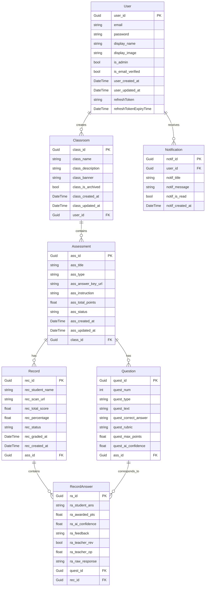
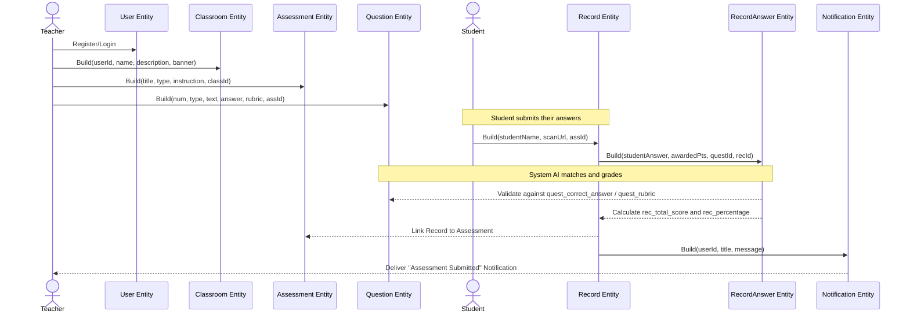

# Backend Entities Diagrams

Since entities are typically structural, an **Entity-Relationship (ER) diagram** has been generated to show the data schema and relationships. Additionally, a **Sequence diagram** is included to illustrate the lifecycle and typical interactions among these entities.

## Entity-Relationship (ER) Diagram

## Entity Lifecycle Sequence Diagram

This sequence diagram demonstrates the logical flow of how these entities are created and interact with each other throughout a typical assessment process.

